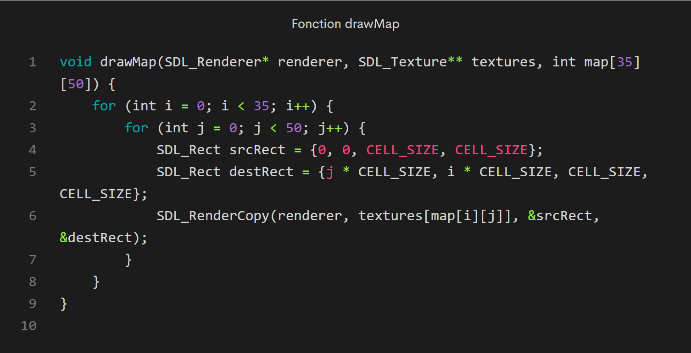

# Documentation de TNDefense

---

## Description du Jeu

**Nom du jeu**: TNDefense

**Genre**: Jeu de survie en vagues

**Concept**: TNDefense est un jeu vidéo développé en C utilisant la librairie SDL (Simple DirectMedia Layer). Le joueur incarne deux personnages (professeurs) qui doivent survivre à des vagues successives d'élèves attaquants. Le but est de résister le plus longtemps aux assaillants tout en éliminant un maximum d'ennemis pour obtenir le meilleur score. Chaque vague devient de plus en plus difficile, augmentant ainsi le défi pour le joueur.

### Règles du Jeu

1. **Objectif Principal**: Survivre le plus longtemps face à des vagues d'élèves.
2. **Mécanismes du jeu**:
    -  **Déplacement**: Le joueur peut se déplacer librement sur la carte pour esquiver/tuer les ennemis.
    -  **SWAP**:Le joueur peut changer de personnage durant la partie afin d'avoir sa barre de vie à nouveau pleine. (chaque personnage possédant chacun son nombre de point de vie)
    -  **Attaque**:Le joueur a la capacité de tirer afin de tuer l'ennemi présent sur la carte.
    -  **Vagues/Niveaux**:La difficulté augmente de manière croissante.
    -  **Score**: Le score augmente en fonction du nombre d'élèves éliminés ainsi que des coins récupérés.
3. **Perte de vie**: Si le joueur est touché par un ennemi, il perd de la vie. Le jeu se termine lorsque la vie du joueur se retrouve à zero.

### Les commandes en jeu
-   **Se déplacer** : Touches directionnelles
-   **Attaquer** : Touche A
-   **Changer de personnage** : Touche D pour le personnage n°1 et Touche S pour le deuxième
-   **Relancer/Quitter le jeu** : Touche Echap

### Langage et Bibliothèques Utilisés

- **Langage**: C
- **Bibliothèque**: 
    - SDL2 (Simple DirectMedia Layer)
    - SDL_image.h
    - SDL_mixer.h
---

## Détails Techniques

### Les fonctions principales:

## Affichage et stockage de la map

La carte est chargée à partir d'une matrice de 35 lignes de 50 éléments. Chaque élément étant un nombre qui représente une tuile de 20px par 20px (sol,mur,etc).

**La fonction prend plusieurs paramètres**:
-   SDL_Renderer*: Un pointeur qui est utilisé pour dessiner des textures sur l'écran.
-   SDL_Texture: Un tableau de pointeurs, où chaque texture représente une tuile différente de la carte.
-   int map[35][50]: La matrice représentant la carte du jeu.

La fonction drawMap parcourt chaque cellule de la matrice de la carte, récupère la texture correspondante pour chaque cellule (en utilisant la valeur entière dans la matrice comme index dans le tableau de textures), et dessine cette texture à la position appropriée sur l'écran en utilisant le renderer SDL. Les textures sont copiées intégralement depuis srcRect vers destRect.

## Gestion des erreurs

Fonction pour gérer les erreurs SDL avec un message

## Contrôle des FPS

Fonction pour assurer l’animation du jeu et le défilement des images à un taux constant qu’on a défini à 80 millisecondes. Si la différence entre deux images est inférieure à 80 SDL_Delay comble ce manque.

=======
## `bool isBlocked(int value)`

**Explication** :  vérifie si une valeur de cellule de la carte représente un obstacle bloquant pour le joueur. Elle retourne `true` si la valeur est comprise entre 1 et 25, à l'exception de quelques valeurs spécifiées, sinon elle retourne `false`.

## `bool isBlocked2(int value)`

**Explication** : Similaire à `isBlocked`,  vérifie si une valeur de cellule de la carte représente un obstacle bloquant pour une balle. Elle retourne `true` si la valeur est comprise entre 1 et 25, à l'exception de quelques valeurs spécifiées, sinon elle retourne `false`.

## `int canMove(int player_x, int player_y, int map[ROWS][COLS], int mvt)`

**Explication** :  détermine si le joueur peut se déplacer dans une direction donnée (1: bas, 2: gauche, 3: droite, 4: haut). Elle vérifie si les cellules de la carte aux positions cibles ne sont pas bloquées en utilisant la fonction `isBlocked`. Elle prend en compte les cas où le joueur n'est pas parfaitement aligné sur une grille de cellules.

## `void createBullet(int last_mvt, struct Bullet bullets[], int player_x, int player_y)`

**Explication** :  crée une nouvelle balle à partir de la position du joueur en fonction de la dernière direction de mouvement (`last_mvt`). Elle parcourt le tableau de balles et trouve la première balle inactive. Ensuite, elle initialise les propriétés de cette balle, y compris sa position, sa direction, sa taille et son état (tirée ou non).

## `int bulletCanAdvance(struct Bullet bullet, int map[ROWS][COLS])`

**Explication** :  vérifie si une balle peut avancer sans rencontrer un obstacle. Elle calcule la position future de la balle en fonction de sa direction et vérifie si la cellule de la carte à cette position est bloquée en utilisant `isBlocked2`. Si la cellule est bloquée, la fonction retourne `false`, sinon elle retourne `true`.

## `int bulletTouchEnnemy(struct Ducky duckies[], struct Bullet bullet, struct Enemy enemies[])`

**Explication** :  vérifie si une balle touche un ennemi. Elle compare les coordonnées de la balle avec celles des ennemis. Si une collision est détectée, la fonction réduit les points de vie de l'ennemi et, si les points de vie tombent à zéro ou en dessous, elle marque l'ennemi comme éliminé et crée un "Ducky" à sa position. La fonction retourne `true` si une collision est détectée, sinon `false`.

## `void drawGrid(SDL_Renderer* renderer)`

**Explication** :  dessine une grille sur l'écran pour aider à visualiser les cellules de la carte. Elle utilise SDL_RenderDrawLine pour dessiner des lignes horizontales et verticales en fonction de la taille des cellules.  est utile pour le débogage et la conception des niveaux.

## `void createDucky(struct Ducky duckies[], int enemy_x, int enemy_y, int death_time)`

**Explication** :  crée un nouveau "Ducky" à la position où un ennemi a été éliminé. Elle parcourt le tableau des "Duckies" et trouve le premier "Ducky" inactif. Ensuite, elle initialise les propriétés de ce "Ducky", y compris sa position, sa taille, son état (apparu ou non), et le moment de son apparition.

## `int playerTouchDucky(struct Ducky ducky, SDL_Rect DestSpritePlayerRect)`

**Explication** :  vérifie si le joueur touche un "Ducky". Elle compare les coordonnées du "Ducky" avec celles du rectangle du joueur. Si une collision est détectée, la fonction retourne `true`, sinon `false`.

## `int getRandomMove()`

**Explication** :  génère et retourne un mouvement aléatoire pour un ennemi (1: haut, 2: bas, 3: gauche, 4: droite). Elle utilise `rand()` pour obtenir un nombre aléatoire entre 1 et 4.

## `void moveEnemyRandomly(Enemy* enemy, int map[ROWS][COLS])`

**Explication** : déplace l'ennemi de manière aléatoire sur la carte. Elle génère une direction de mouvement aléatoire et vérifie si l'ennemi peut se déplacer dans cette direction en utilisant `canMove`. Si le déplacement est possible, elle met à jour les coordonnées de l'ennemi et ses propriétés de mouvement.

## `void EnemyMove(Enemy* enemy, int map[35][50], int player_x, int player_y)`

**Explication** :  déplace l'ennemi en direction du joueur. Elle calcule le déplacement en fonction des coordonnées du joueur et de l'ennemi. Elle tente de déplacer l'ennemi horizontalement d'abord, puis verticalement, en vérifiant si le mouvement est possible avec `canMove`. Si aucun déplacement vers le joueur n'est possible, l'ennemi se déplace de manière aléatoire. Les propriétés de mouvement de l'ennemi sont mises à jour en conséquence.

5. Gestion de l'attaque

cette fonction configure les balles pour être tirées dans la direction du dernier mouvement du player. Elle prend en paramètre pour cela last_mvt qui indique la dernière direction de mouvement du player. En ce qui conçerne les bullets on leur a conçu une structure spécifique : fired: designe si la balle a été tirée ou pas , direction: stocke la direction de la balle , damage: représente le dégat de la bullet qui touche l'ennemi sur son hp.

on remarque dans cette fonction que lorsque une balle touche un ennemi on soustrait le damage de la balle du hp de l'ennemi.
Quand hp devient inférieur à 0 cela signifie que l'ennemi est mort et on le remplace par un ducky.

6. Système de récompense 

Dans la structure de ducky on remarque qu'il a une variable value. Cette variable représente les points que va collecter le joueur et ajouter à son score  en prenant ce ducky. On visualise cela dans le fragment de code suivant présent dans game.C:

